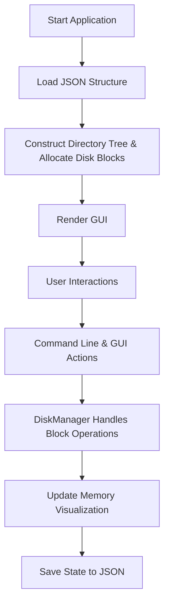
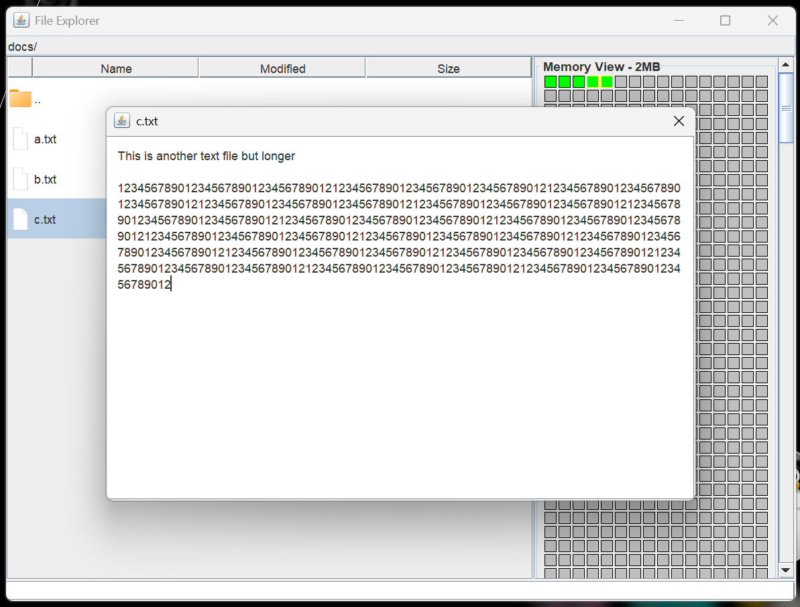
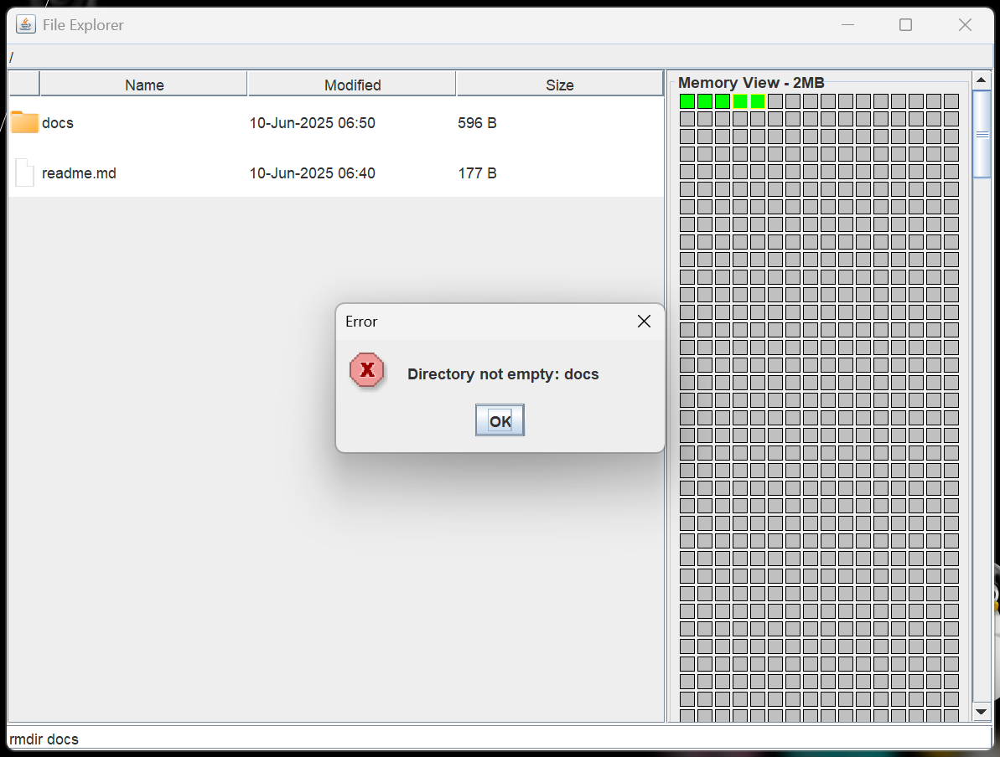
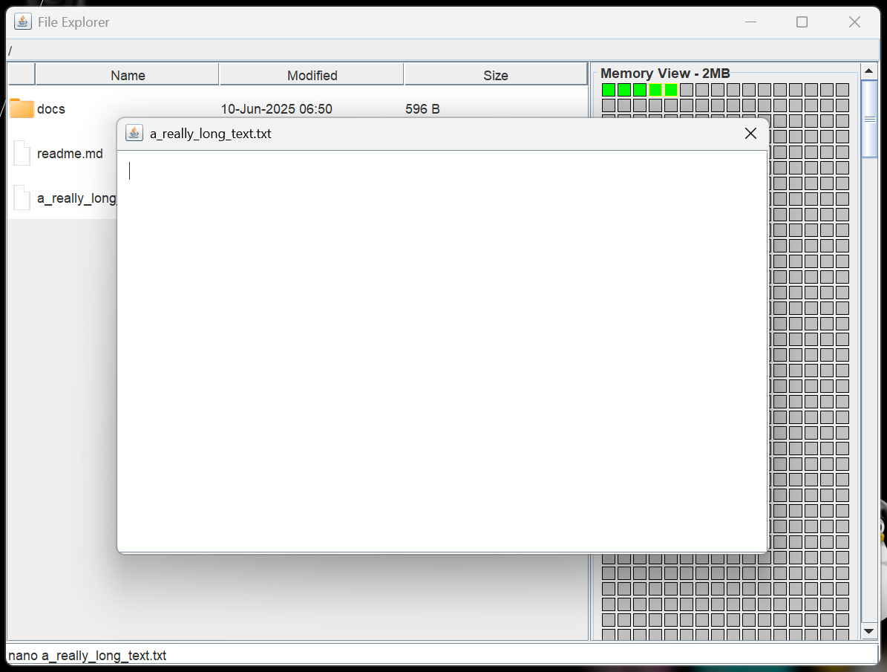
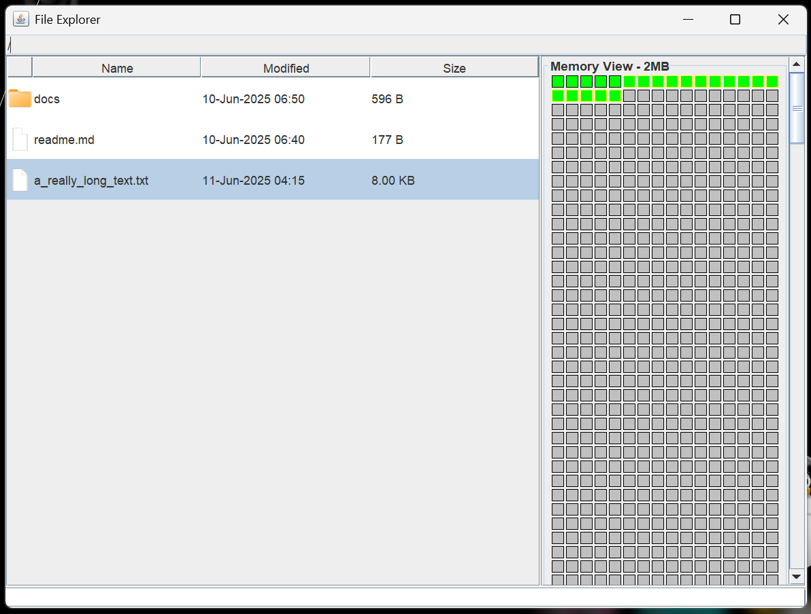

# MemoManager: File Management System Simulator

[](https://www.oracle.com/java/)
[](#)
[](LICENSE)<br>
[](#)

**MemoManager** is a Java-based file system simulator designed for educational and demonstrative purposes. It provides an interactive graphical interface for managing files and directories, visualizing memory allocation, and simulating contiguous file allocation strategies as used in operating systems.

-----

## Key Features

- **Graphical File Explorer:** Intuitive desktop-style interface for file and directory management.
- **Memory Block Visualization:** Real-time simulation of contiguous disk block allocation.
- **Integrated Command Line:** Supports classic file system commands (`mkdir`, `cd`, `rmdir`, `touch`, `nano`, `rm`) within the GUI.
- **File Editing:** Built-in editor with change detection and save confirmation.
- **Persistent Storage:** File system state is saved and loaded from a JSON file, including metadata and block mappings.
- **Educational Focus:** Demonstrates core OS concepts such as file system trees, block allocation, and fragmentation.

-----

## Project Workflow



**Process Overview:**
1.  **Startup:** The application initializes by loading the file system structure from `src/resources/structure.json`.
2.  **Initialization:** A directory tree is constructed, and disk blocks are allocated based on the loaded JSON data using the `DiskManager.java`.
3.  **GUI Rendering:** The main `Explorer.java` window displays the file/directory tree and the `MemoryPanel.java` visualizes the disk block usage.
4.  **User Actions:** Users interact with the file system through either double-clicks on table entries or by entering commands in the integrated command line interface.
5.  **Memory Management:** The `SystemController.java` processes user commands, which in turn utilize the `DiskManager.java` to simulate block-level operations (allocation, deallocation) for each file action.
6.  **Persistence:** All changes made to the file system are automatically saved back to the `structure.json` file by the `FileSaver.java`, ensuring the state is consistent and persistent.

-----

## Directory Structure

```plaintext
src/
├── Assets/                     # Icons and images (referenced in Explorer.java)
├── resources/
│   └── structure.json          # Persistent file system state
├── Model/                      # Core logic
│   ├── Block.java
│   ├── Directory.java
│   ├── DiskManager.java
│   ├── File.java
│   ├── FileLoader.java
│   ├── FileSaver.java
│   └── SystemNode.java
├── View/                       # Java Swing GUI components
│   ├── Explorer.java
│   └── MemoryPanel.java
├── Controller/                 # Application logic and event handling
│   └── SystemController.java
└── App.java                    # Application entry point
```

-----

## Getting Started

### Prerequisites

  - Java Development Kit (JDK) 17 or higher
  - [Jackson Databind](https://github.com/FasterXML/jackson-databind) (for JSON parsing and serialization)

### Installation

1. Clone the repository:

    ```sh
    git clone https://github.com/codewara/memomanager.git
    cd memomanager
    ```
    
2. Download the Jackson Databind JAR files (e.g., `jackson-databind.jar`, `jackson-core.jar`, `jackson-annotations.jar`) and place them in a `lib/` folder within the `memomanager` directory.

### Build

```sh
javac -cp ".;lib/*;src" src/App.java src/Controller/*.java src/Model/*.java src/View/*.java
```

### Run

```sh
java -cp ".;lib/*;src" App
```

*Note: Use `:` instead of `;` on Unix-based systems for the classpath.*

-----

## Usage

### GUI Operations

- **Navigation:** Double-click on directory entries to navigate into them. Click ".." to move up one directory level.
- **File Editing:** Double-click on a file to open its content in a separate editor dialog. You can modify the text, and upon closing the dialog, you will be prompted to save your changes.
- **Memory Visualization:** The panel on the right side of the explorer window displays the simulated disk memory. Green blocks represent used memory, light gray blocks represent free memory, and yellow borders highlight blocks used by the currently selected file or directory.

### Command Line Interface (CLI)

Enter commands in the text field at the bottom of the main window:

| Command        | Description                                                                                               |
| -------------- | --------------------------------------------------------------------------------------------------------- |
| `mkdir <dir>`  | Creates a new empty directory with the specified name.                                                    |
| `cd <dir>`     | Changes the current working directory to the specified directory.                                         |
| `cd ..`        | Moves up one level to the parent directory.                                                               |
| `rmdir <dir>`  | Removes an empty directory. Fails if the directory contains files or subdirectories.                      |
| `touch <file>` | Creates a new empty file or updates the modified timestamp of an existing file.                           |
| `nano <file>`  | Opens the specified file for editing. If the file does not exist, a new empty file is created and opened. |
| `rm <file>`    | Deletes the specified file and deallocates its corresponding disk blocks.                                 |

-----

## Educational Concepts Demonstrated

- **File System Tree Structure:** Illustrates the hierarchical organization of files and directories with parent-child relationships.
- **Contiguous Disk Block Allocation:** Visualizes how files are stored in contiguous blocks of memory on a simulated disk, demonstrating the concept of fragmentation.
- **Memory Management and Optimization:** Provides a hands-on understanding of how disk space is allocated and deallocated as files are created, modified, or deleted.
- **Model-View-Controller (MVC) Software Architecture:** The project is structured using the MVC pattern, separating the application's data (Model), user interface (View), and logic (Controller).

-----

## Screenshots
|                                           |                                           |
| :---------------------------------------: | :---------------------------------------: |
|  |  |
|  |  |

-----

## License

This project is licensed under the [MIT License](LICENSE).  
© 2025 Datuk Daneswara Raditya Samsura

-----

## Acknowledgments

- Java Swing for GUI components
- Jackson for JSON parsing
- Inspired by classic operating system and file system simulation exercises
